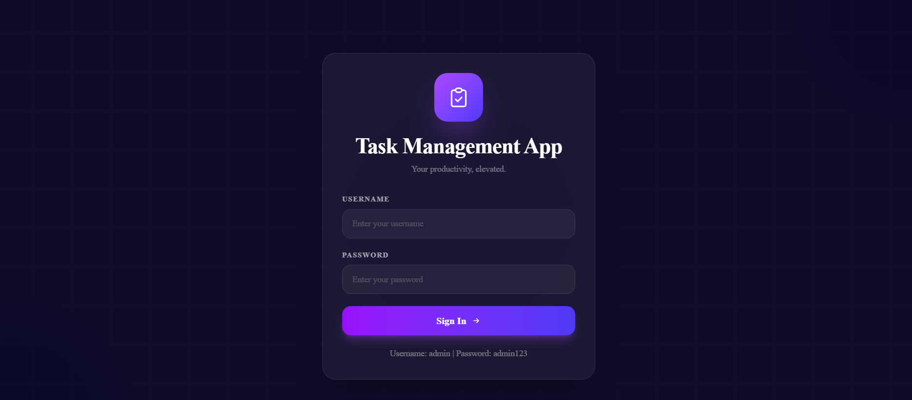
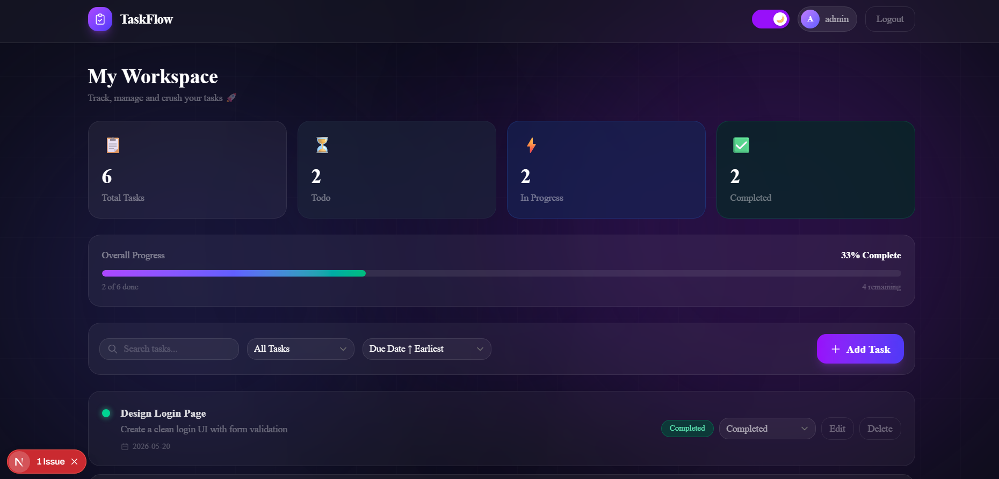
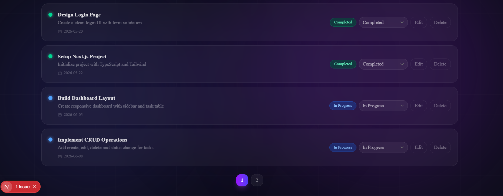
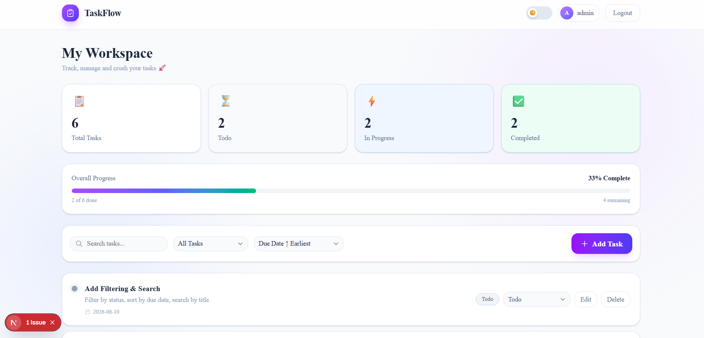
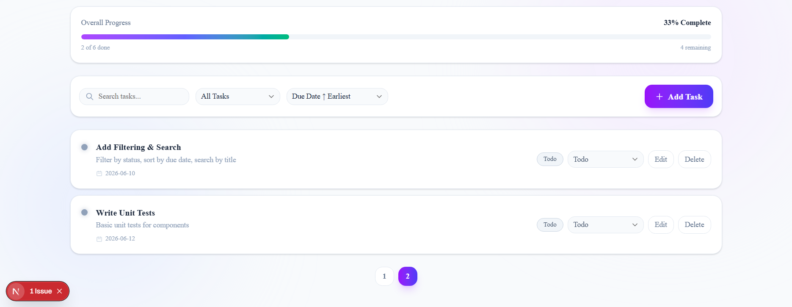

# TaskFlow - Task Management Dashboard

A modern, responsive Task Management App built with Next.js, TypeScript, Tailwind CSS, and shadcn/ui.

## 📸 Screenshots

### Login Page


### Dashboard - Dark Mode



### Dashboard - Light Mode



## 🚀 Features

- **Mock Authentication** - Login with session stored in localStorage
- **Task Dashboard** - View all tasks in a clean card layout
- **CRUD Operations** - Create, Edit, Delete tasks
- **Status Management** - Todo / In Progress / Completed
- **Filtering** - Filter tasks by status
- **Sorting** - Sort by due date (ascending/descending)
- **Search** - Search tasks by title
- **Pagination** - 4 tasks per page
- **Dark/Light Mode** - Toggle between dark and light themes
- **Progress Tracker** - Visual progress bar showing completion percentage
- **Responsive Design** - Works on all screen sizes

## 🛠️ Tech Stack

- **Framework**: Next.js 16 (App Router)
- **Language**: TypeScript
- **Styling**: Tailwind CSS
- **UI Components**: shadcn/ui
- **State Management**: React useState/useEffect
- **Auth**: Mock authentication with localStorage

## 📦 Setup Steps

### Prerequisites
- Node.js 18+
- npm

### Installation

**1. Clone the repository**
```bash
git clone https://github.com/YOUR_USERNAME/task-dashboard.git
cd task-dashboard
```

**2. Install dependencies**
```bash
npm install
```

**3. Install shadcn/ui components**
```bash
npx shadcn@latest add button input label card dialog select badge
```

**4. Run the development server**
```bash
npm run dev
```

**5. Open in browser**

http://localhost:3000

## 🔐 Login Credentials

Username: admin
Password: admin123

## 📁 Folder Structure

task-dashboard/
├── app/
│   ├── dashboard/
│   │   └── page.tsx          # Main dashboard page with all features
│   ├── login/
│   │   └── page.tsx          # Mock login page
│   ├── data/
│   │   └── tasks.ts          # Mock task data
│   ├── types/
│   │   └── index.ts          # TypeScript interfaces (Task, Status)
│   ├── globals.css           # Global styles
│   ├── layout.tsx            # Root layout
│   └── page.tsx              # Root redirect to /login
├── components/
│   └── ui/                   # shadcn/ui components
│       ├── button.tsx
│       ├── input.tsx
│       ├── label.tsx
│       ├── card.tsx
│       ├── dialog.tsx
│       ├── select.tsx
│       └── badge.tsx
├── public/
│   ├── login.png             # Login page screenshot
│   ├── dashboard-dark.png    # Dashboard dark mode screenshot
│   ├── dashboard-dark-2.png  # Dashboard dark mode tasks
│   ├── dashboard-light.png   # Dashboard light mode screenshot
│   └── dashboard-light-2.png # Dashboard light mode tasks
├── components.json           # shadcn configuration
├── tailwind.config.ts        # Tailwind configuration
├── tsconfig.json             # TypeScript configuration
└── README.md

## 🎨 Design Decisions

- **Dark-first Design**: Deep dark background (`#0d0d1a`) with purple/indigo gradient orbs for a modern, professional aesthetic
- **Glass Morphism**: Used `backdrop-blur` and `bg-white/5` for frosted glass effect on cards and modals
- **CSS-only Background**: No external images — pure CSS gradients for fast loading and consistent look across all devices
- **shadcn/ui Components**: Used for accessible, customizable UI components (Dialog, Select, Input, Badge etc.)
- **Mock Authentication**: localStorage-based auth as per requirements — no backend needed for this task
- **Pagination**: 4 tasks per page for clean UX and better readability
- **Dark/Light Mode Toggle**: Smooth instant transition between themes without page reload
- **Progress Bar**: Visual indicator showing overall task completion percentage
- **TypeScript**: Strict typing with no `any` — all interfaces defined in `app/types/index.ts`
- **Reusable Structure**: Clean separation of data, types, and pages for maintainability

